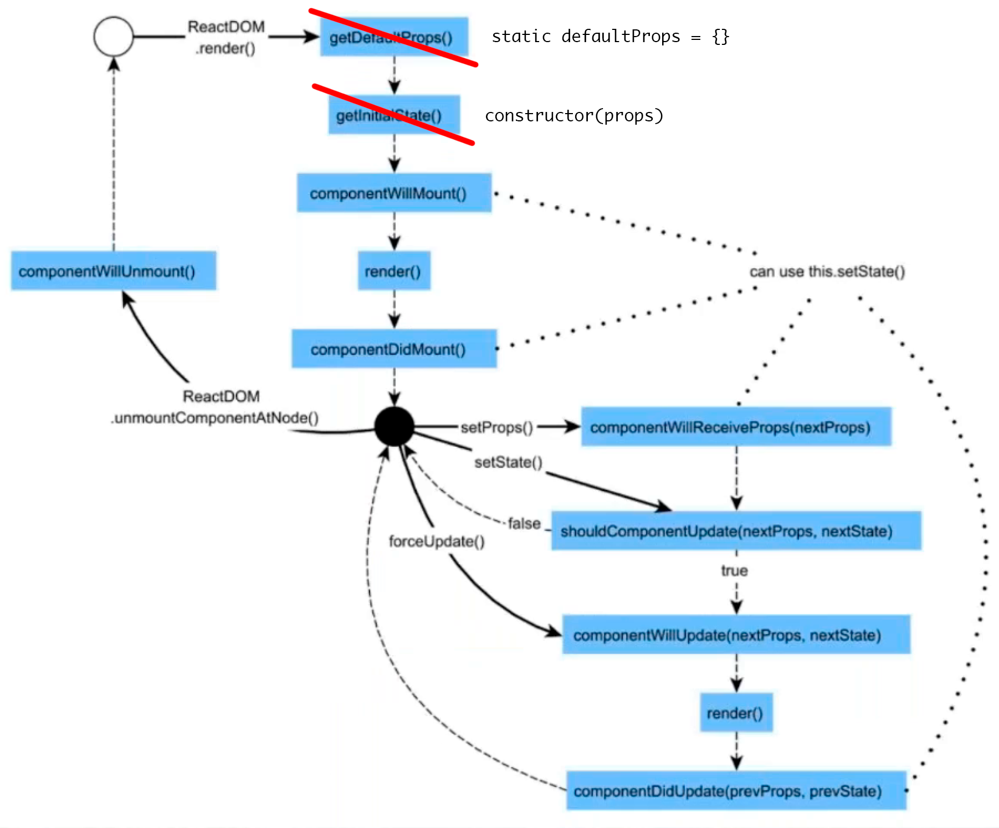

# Занятие №2, 27 апреля
См. код в ветке `2nd_lecture` в форке.

## Статические свойства
Статические свойства компонента — это свойства именно класса или функции: `Comment.staticProperty`.

Роман использует нотацию для статических свойств класса, которая [пока не в стандарте](https://babeljs.io/docs/plugins/transform-class-properties/).

## Значение по умолчанию
Чтобы не делать лишних проверок можно указывать пропсы по умолчанию (данные, которые должна приходить в компонент, но могут и не приходить):

```jsx
class CommentList extends Component {
    static defaultProps = {
        // если каменты из пропсов не пришли, то пусть будет пустой массив,
        // чтоб в любом случае было, что итерировать и не делать проверки !comments
        comments: []
    }

    // ...
    const {comments} = this.props;
}

// Так тоже можно:
CommentList.defaultProps = { // (*)
    comments: []
};
```

В функциональных компонентах можно использовать нотацию `(*)` или сразу задать значение по-умолчанию для параметра:

```jsx
function Comment({comment = {}}) { // дефолтные пропсы
    return (
        <div className="comment">
            <div className="comment__user">
                <strong>{comment.user}</strong>
            </div>
            <div className="comment__text">
                {comment.text}
            </div>
        </div>
    )
}
```

## propTypes
Динамическая проверка типов. Позволяет в рантайме определить, правильные ли данные пришли в компонент. Позволяет описать API компонента: какие данные, какого типы ожидаются на вход.

Вынесли с 15.5 в [отдельную библиотеку](https://www.npmjs.com/package/prop-types).

`propTypes` — статический метод класса или функции (если функциональный компонент).

На сколько детально описывать типы пропсов решает разработчик. Роман описывает все поверхностно и уходит в детали только когда это действительно нужно.

Если нужно прям детально все чекать, то, возможно, стоит использовать решение для типизации: Flow или TypeScript.

## React Dev Tools
В отдельной вкладке можно посмотреть виртуальный DOM.

## Hot Module Replacement
Чтобы обновлять страницу без изменения стейта (что открыто — останется открыто) нужно установить пакет [`react-hmre`](https://www.npmjs.com/package/babel-preset-react-hmre) (отдельный пресет для HMR в Бабеле) и прописать пресет в `.babelrc`:

```json
{
    "presets": ["react", "es2015", "stage-0", "react-hmre"]
}
```

Очень удобно, когда надо добраться до вложенных компонентов.

Обновление будет происходить только при именении кода в методе `render`. Если менять какие-то вспомогательные функции, то надо по прежнему руками обновлять.

## Реиспользование
Чтобы вынести какой-то функционал, мы можем создать класс, там хранить общие методы и наследовать не от `Component`, а от этого класса. Но так в Реакте делать не принято. Слоно отследить цепочку наследования. Используют Higher Ordered Components.

### Миксины
От миксинов отказались и задепрекейтили. В старом Реакте были, но сейчас [от них отказались](https://facebook.github.io/react/blog/2016/07/13/mixins-considered-harmful.html). Классы ES6 и функциональные компоненты — хватает. В 15.5.

`React.createClass` так же задепрекейчен.

### Композиция
Не понял, что это...

### Higher-Order Components
HOC, они же декораторы, — функции, в которые оборачиваются компоненты. Компонент, который принимает компонент, добавляет к нему какой-то функционал и возвращает.

Статья: https://medium.com/@dan_abramov/mixins-are-dead-long-live-higher-order-components-94a0d2f9e750

Как правило метод `render` в декораторах не меняет то, что рендерится в декорируемом компоненте. Он просто возвращает декорируемый компонент и передает ему все пропсы:

```js
render() {
    return <OriginalComponent {...this.props} />
}
```

Если получается переделать что-то на функциональный компонент (без стейта), то надо переделывать. Так код станет проще, понятней и лучше тестироваться.

В Stateless-компонентах нет lifecycle методов. Они доступны только для классов. Stateless-компонент просто получает пропсы и рендерит что-то. Его можно сделать на классах, но так делать не нужно, нужно делать functional component.

## Lifecycle
Методы жизненного цикла компонента можно разделить на 2 группы:

* исполняются один раз при инициализации или дестрое
* методы обновления



Методы жизненного цикла не доступны для стейтлес-компонентов, только для классов.

`componentWillMount()` — перед инициализацией. Компонента еще нет в реальном доме, срабатывает до вызова `render`. Потом `render`, а потом `componentDidMount()`.

В 15.5 вместо `getDefaultProps()` пишем `static defaultProps = {}`, вместо `getInitialState()` используется `constructor` класса.

Можно завязать начальный стейт компонента на пропсы, передаваемые в конструктор класса, но с этим надо аккуратно, это не сильно хорошо:

```js
constructor(props) {
    super()
    this.state = { // не очень хорошая практика
        isOpen: props.defaultOpen
    }
}
```

В большинстве случаев завязывать стейт на пропсы — плохая практика.

`componentWillRecieveProps(nextProps)` происходит, когда обновляется кто-то из родителей, даже если у самого компонента пропсы не менялись. Виртуальный ДОМ же перестраивается, и следовательно компонент обновляется.

`shouldComponentUpdate(nextProps, nextState)` — помогает при оптимизации. Сравнить пропсы и состояние.

`componentWillUpdate(nextProps, nextState)` — перед рендерингом, можно сравнивать текущие и будущие свойства и стейт.

Потом `render`.

`componentDidUpdate(prevProps, prevState)` — все отрисовалось.

## Обратный поток данных (Reverse data flow)
Пример — аккордеон со статьями. Каждый элемент аккордеона — компонент статьи. Мы хотим, чтобы при клике на статью она раскрывалась, а остальные закрывались. Соответственно, состояние хранить в статье не выйдет (на нее влияют соседи), нужно поднимать его на уровень выше — в список статей.

Получается, что стейт живет в `ArticleList`, а управляем мы им из дочернего компонента `Article`. Это называется обратный поток данных.

## shouldComponentUpdate
`shouldComponentUpdate(nextProps, nextState)` помогает определить, надо ли вообще перестраивать виртуальный ДОМ или нет.

Нужно быть очень аккуратным, чтобы не потерять пропсы и стейты. Если используются мутабельные данные (меняются объекты по ссылке), то будут проблемы.

## Домашка
* Прочитать статью [Mixins Are Dead. Long Live Composition](https://medium.com/@dan_abramov/mixins-are-dead-long-live-higher-order-components-94a0d2f9e750)
* Допилить аккордеон (см. ридми в репе для заданий).

