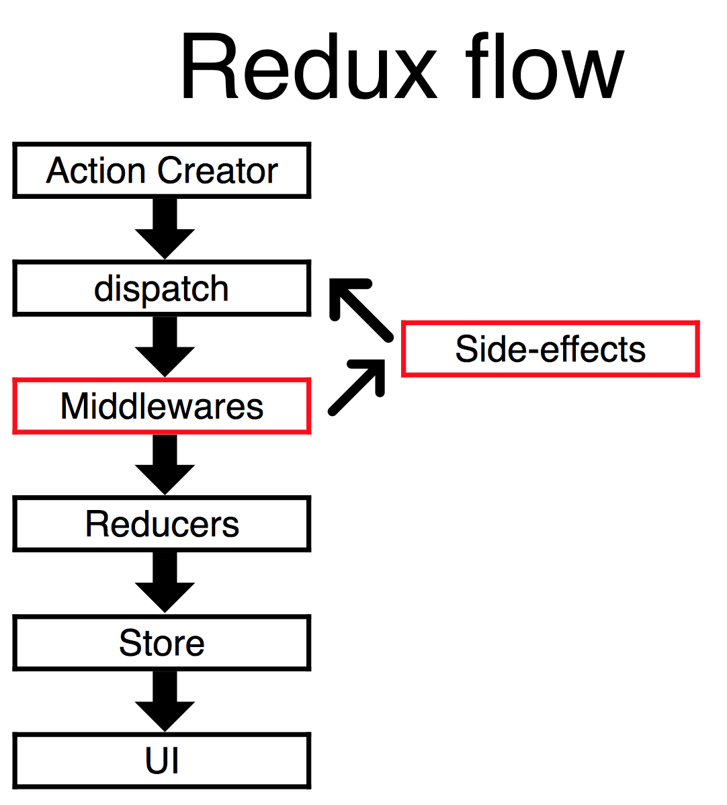

# Занятие №4, 15 мая
Завязываем про API Реакта и начинаем про построение бизнес-логики приложений.

Ветка `4th_lesson_redux`.

## Проверка домашки
Нужно все делать императивно, не лезть в дом.

Вместо того, чтобы делать `el.style.borderColor = 'red'` надо делать `<input className={this.getClass('user')>` и вычислять класс по ходу дела. Это не jQuery.

И при валидации все завязывать на функции, которые используют стейты, а не содержимое инпутов.

Не нужно в стейте держать много чего. Все, что можно вычислить — надо вычислять по ходу дела. Например, не надо в стейте держать переменную, валидно ли поле юзера. Завел функцию, правязал ее к `onChange` и она мониторим стейт и возвращает что надо. Классы ставить тоже таким образом — завязываясь на стейт. См. [исправленную КоментФорму из домашки](https://github.com/amiskov/js_ru_20_04_19_30/blob/hometask3/src/components/CommentForm/index.js).

Вспоминаем про нормализацию БД. Когда у нас много полей в стейте, которые друг от друга зависят, мы имеем несколько источников истины, которые надо постоянно проверять. Зачем? Можем вычислить — вычисляем в процессе рендеринга.

## Redux
Переходим к построению приложений из компонентов. Их мы делать уже научились.

[Redux](http://redux.js.org/) — библиотека для построения бизнес-логики для Реакт-приложений. 

Некоторые стейты нормально хранить непосредственно в компоненте (открыта или закрыта стать). А некоторые нужно расшаривать между компонентами. Чтоб не пробрасывать пропсы куда-то глубоко придумали Flux и Redux.

[Презентация](http://slides.com/romaniakobchuk/deck-9-10-11-13-19#/) Романа про Redux.

* Redux построен на принципах функционального программирования. Строится на чистых функциях и иммутабельных данных, всегда имеем предсказуемое состояние, высокая отказоустойчивость
* Не зависит от окружения: сервер, браузер, мобила, ...
* Имеется удобный контроль на зависимыми событиями (без колбэков)
* Имеются хорошие дев-тулзы: ивент-сорсинг, тайм тревел, ... (очень способствовали популярности Редакса)

Store — один иммутабельный объект, где хранится состояние приложения. Нельзя менять ничего по ссылкам, нужно вызывать новое состояние стора:


В Редаксе существует единственный стор и в нем есть диспетчер.

## Одностононний поток данных
* Не меняем ничего в Сторе напрямую.
* UI отображает состояние Стора. Меняется состояние Стора с помощью экшенов: плоских объектов, которые описывают, что происходит в системе.
* Экшены попадают в бизнес-логику черзе экншен-криейтоеры, с помощю диспетчера попадают в Редьюсеры: они принимают текущее состояние Стори и экшен и возвращают новое состоняние Стора.
* И потом новое состояние Стора попадает в UI.



* Action Creator создает запрос в виде плоского объекта: что мы хотим получить от системы.
* Этот запрос получает Dispatcher и передает его в бизнес-логику (в Reducer).
* Reducer обрабатывает запрос и возвращает _новое_ состояние Стора.
* UI получает новое состояние Стора и перерисовывается.

## Создаем счетчик на Редаксе
Устанавливаем `npm i redux -D`.

Создаем компонент `Counter.js`.

Создаем Стор: `src/store/index.js`, импортим `createStore` из `redux`. Стору нужен обязательный аргумент — reducer.

Reducer управляет состоянием Стора. Создается отдельно: `src/reducer/index.js`. Обычно разбивают на файлы по функционалу: `counterReducer`, `articleReducer` и т. д. А в главном файле импортят `{combineReducers} from 'redux`. `combineReducer` объединить все мелкие редюсеры в один большой. Его мы импортим в `store/index.js` и передаем параметром в `createStore(reducer)`.

Стор импортим в главном файле приложения. `App.js`, например. У него есть метод `.getState()`, можно смотреть, что там в процессе работы.

При инициализации (запуск `createStore()`) Redux пропускает тестовый Action и удобно задавать дефолтные значения в редюсерах:

```jsx harmony
export default combineReducers({
    counter: (number = 0, action) => number + 1 // сработает при инициаллизации, number станет 1, т. к. не обрабатывается экшн и срабатывает на любое изменение в сторе
})
```

По сути в Редюсерах живет вся бизнес-логика.

Чтобы вообще все в Редюсерах не выполнялось на каждый чих используются экшены.

### Actions
Действует соглашения:
* У каждого экшна есть обязательное поле `type`, по которому их различают

Экшены (вот эти плоские объекты с полями `type` и `data`) руками не делают, а используют функции Action Creators. Создают папку `src/AC` и там их хранят.

Редакс не привязан к Реакту и может использоваться (теоретически) сам по себе. Играются с ним на Агнуляре и Эмбере даже. Чтобы не привязывать Редакс к Реакту выделили отдельно библиотеку `react-redux`. Нам оттуда нужен прежде всего декоратор `connect` — связывает React и Redux (Стор с компонентами)

`connect` — функция, которая возвращает декоратор (фабрика декораторов). Вызывается так: `export default connect([options])(ComponentName)`.

Чтобы `connect` заработал, нужно приложение обернуть в `<Provider store={store}/>` из `react-redux`. Создают корневой компонент `Root` вида:

```jsx harmony
class Root extends Component {
    static propTypes = {
        store: PropTypes.object.isRequired
    };

    render() {
        return (
            <Provider store={this.props.store}>
                <App articles="{[]}" />
            </Provider>
        );
    }
}
```

И уже его рендерять в главном файле приложения. Он отрисует все приложение, обернутое в `<Provider/>`. После этого в пропсах появится метод `dispatch`. Его добавил `connect`.

## Стор или Стейт компонента?
То, что нужно только компоненту нужно хранить в стейте компонента. А то, что нужно приложению (разным компонентам), то хранить его надо в Сторе.
