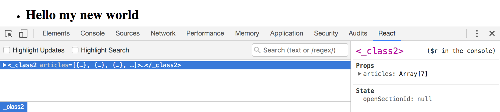
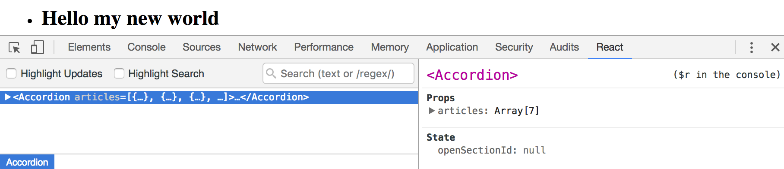

# Хорошие практики

## Не возвращать анонимных классов
Даже в декораторах нужно указывать имена возвращаемых классов, чтобы их было видно в средствах разработи.

Плохо, класс — анонимный:
```js
export default Sections => class extends Component {
    // ...
}
```

В Dev Tools непонятная херня:



Хорошо, у класса есть имя:

```js
export default Sections => class Accordion extends Component {
    // ...
}
```

В Dev Tools все понятно:




## `super()` в конструкторе класса, наследующего от другого класса
`this` в конструкторе класса можно использовать только после вызова родительского конструктора (`super()`):

```jsx harmony
class ArticleStore extends EventEmitter {
    constructor(initialState = []) {
        super(); // без этого
        this._items = {}; // ...тут будет ошибка
    }
}
```
