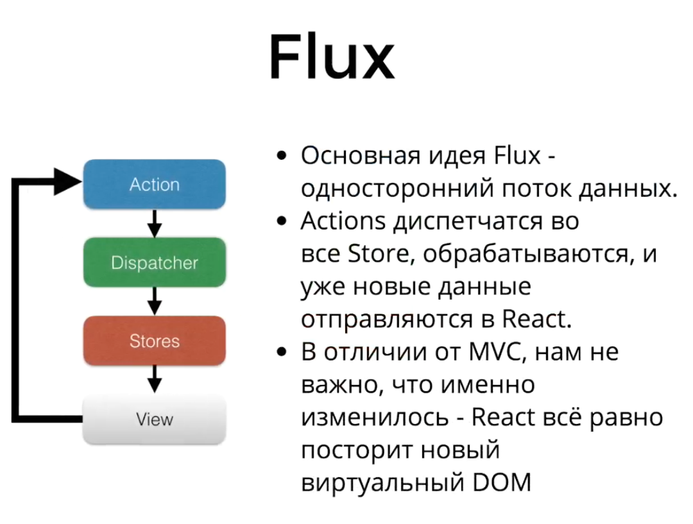
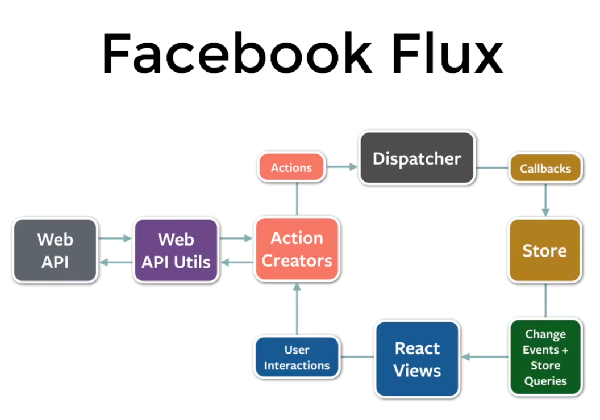
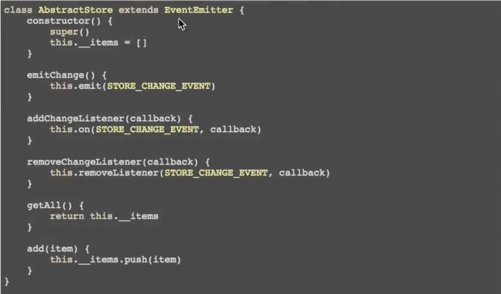

# Flux
Код в ветке `screencast_flux` форка.

## Общие сведения, скринкаст `flux_1`
При изменении стейта (как правило через `setState`) Реакт перестраивает виртуальный дом _от компонента, где произошло изменение вниз по дереву_.

Для Реакта не характерна логика MVC/MVVM. Дружить его с Ангуляром/Бэкбоном и пр. фреймворками, которые работают с данными, но используют более классический подход — плохая идея.



## Подробнее, скринкаст `flux_2`

В Реакте — однонаправленный поток данных. Двусторонний даба-байндинг — такого нету, все в одну сторону.

Stores — хранят данные (все статьи, например). И из них уже читают данные компоненты (вьюхи).

Модифицировать стор из вьюхи — плохо. Так никто не делает. Для этого мы делаем экшн (Action) — юзер нажал на кнопку, вызываем экшн.

Экшн попадает в диспетчер (Dispatcher), который направляет экшн _во все сторы которые есть_. Абстрагирует общение между сторами и экшенами. Он может следить за порядком выполнения экшенов, чтобы не было циклической зависимости и пр.

Экшены могут вызываться не только во вьюхе. Может это от подписки на веб-сокет, из самого стора и т. д.

Сторы реагируют на экшены.

Данные идут всегда в одном направлении.

## Реализации
Есть много реализаций. Самая популярная сейчас — Redux. Более высокоуровневая, чем сам Flux, проще и быстрее разрабатывать.

Однако Flux хорош для изучения, т. к. он более низкоуровневый.



Любое Реакт-приложение начинается с данных. Реакт он и создат, чтобы репрезентовать данные и делать это всегда одинаково.

Методы, которые меняют сторы, должны быть приватными. Сторы не должны менять себя/друг-друга на прямую. Нужно все делать через экшены.

Данные проще хранить как объект, где `id` — ключи, а значения — содержимое. Так лучше работать с данными, чем хранить просто массив объекта:

```json
{
"articles": {
  ""
}
}
```

В компонентах метод `render()` принято делать чистой функцией от пропсов и стейтов: чтоб она зависела только от своих аргументов (пропсов и стейтов) и не от чего больше:

```jsx harmony
render() { // принято делать чистой функцией от пропсов и стейтов
           // должна зависеть от своих аргументов (пропсов и стейтов) и не от чего больше
    return (
        {/*<ArticleList articles={articleStore.getAll()}/> // так делать плохо, надо перенести в стейт*/}
    );
}
```

Пример реализации простого стора:



EventEmitter можно взять из `npm i events -S`. Есть еще [`fbemitter`](https://www.npmjs.com/package/fbemitter), который идет с пакетом `flux`.

Хорошая практика — выносить подписку на события `componentDidMount` в конструкторе или в componentWillMount лучше не подписываться, потому что при серверном рендеринге мы не сможем отписаться и получим утечку памяти. Даже если не юзаем серверный рендеринг — ну пусть тут лежит, на всякий случай:

```jsx harmony
componentDidMount() {
    articleStore.addChangeListener(this.handleChange)
}
```

Сама библиотека Flux от Фейсбука дает [диспетчер](https://facebook.github.io/flux/docs/dispatcher.html#content) и несколько полезных утилит. Часто используют только диспетчер.

Диспетчер — синглтон. Он один на все приложение. Сторы, компоненты, экшн криейторы — все завязано на один диспетчер.

Action Creator — функция, которая создает экшн — обычный плоский объект. По соглашению в нем должны быть свойства `type` (что мы делаем) и `payload` (полезная нагрузка, что нужно, чтобы действие совершилось, параметры):

```jsx harmony
export function deleteArticle(id) {
    const action = {
        type: 'DELETE_ARTICLE',
        payload: {
            id
        }
    };
}
```

В стор попадают _все_ экшены, которые создаются во всем приложении. И нам важно понять, какие экшены нас интересуют в определенном сторе. Обычно это делают просто через `switch/case` по `type`.


